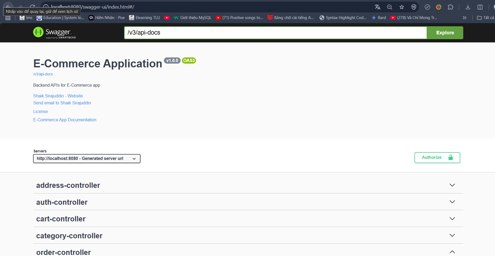
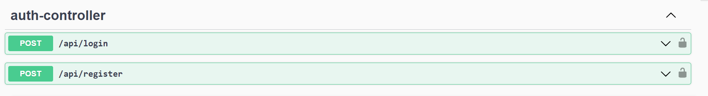
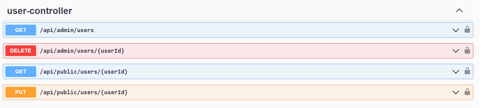
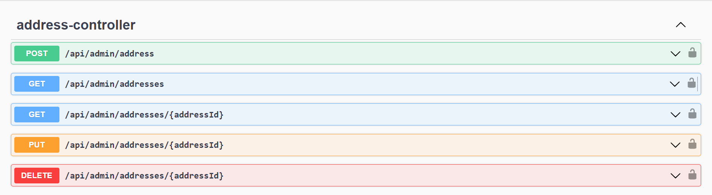
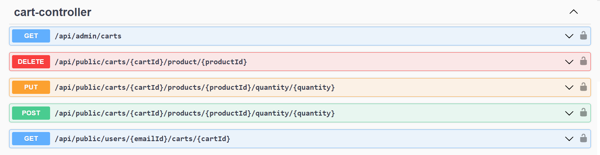
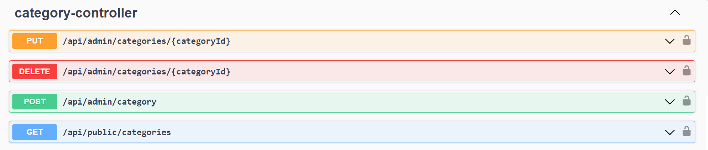
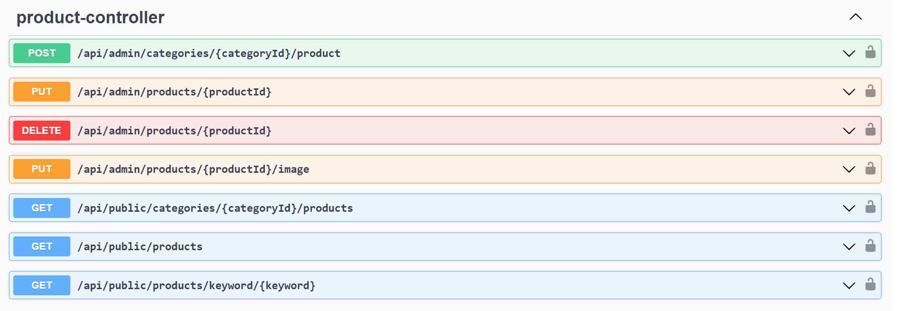
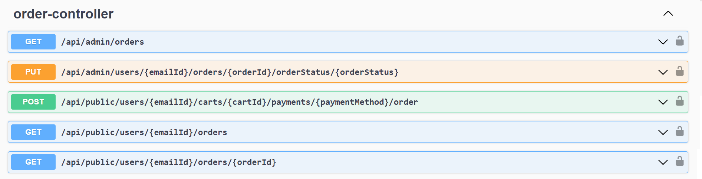

🛒 E-Commerce Application

An advanced, secure, and scalable E-Commerce RESTful API backend built with Java 17, Spring Boot 3, and MySQL. This project is designed to support core features of an online store, including user authentication, product and category management, order processing, and cart functionality.

📌 Overview

This application is developed to ensure security, scalability, and maintainability for real-world use. It utilizes:

Spring Data JPA for ORM and database interactions

Auth0 with JWT for authentication and authorization

Swagger UI for comprehensive API documentation

✅ Key Features

🔐 Admin Panel:

Admin Login

Manage Users

Manage Addresses

Manage Categories

Add/Update Products

Set Price & Discounts

View Orders

🙋‍♂️ User Side:

User Registration & Login

Browse Products by Category

Add/Delete Products from Cart

Manage Shipping Address & Product Quantity

Place Orders and Track Status

🔐 Security

Authentication is handled via JSON Web Tokens (JWT) powered by Auth0. After logging in, users must pass the received token in the Authorization header to access protected endpoints.

Example:

Authorization: Bearer <your_jwt_token>

🧰 Tech Stack

Java 17+

Spring Boot 3

Spring Data JPA

Spring Security

JWT (JSON Web Tokens)

Auth0

SQL server

Swagger UI

Maven

🚀 Getting Started

1. Clone the Repository

git clone https://github.com/Sirajuddin135/E-Commerce-Application.git

2. Import into IDE (Spring Tool Suite / IntelliJ IDEA)

Open IDE

Navigate to File > Import...

Choose Maven > Existing Maven Projects

Browse to project directory and finish setup

3. Configure Database
Update the application.properties file with your local SQL server credentials:

spring.datasource.driver-class-name=com.microsoft.sqlserver.jdbc.SQLServerDriver
spring.datasource.url=jdbc:sqlserver://localhost:1433;databaseName=<your_db_name>;encrypt=false
spring.datasource.username=<your_username>
spring.datasource.password=<your_password>

4. Run the Application

From your IDE:

Right-click the project > Run As > Spring Boot App

./mvnw spring-boot:run

📑 API Documentation

Once the app is running, API documentation is available at:

👉 http://localhost:8080/swagger-ui/index.html

📷 Swagger UI Preview:

🗂️ API Controllers

📜 License
This project is open-source and available under the MIT License.